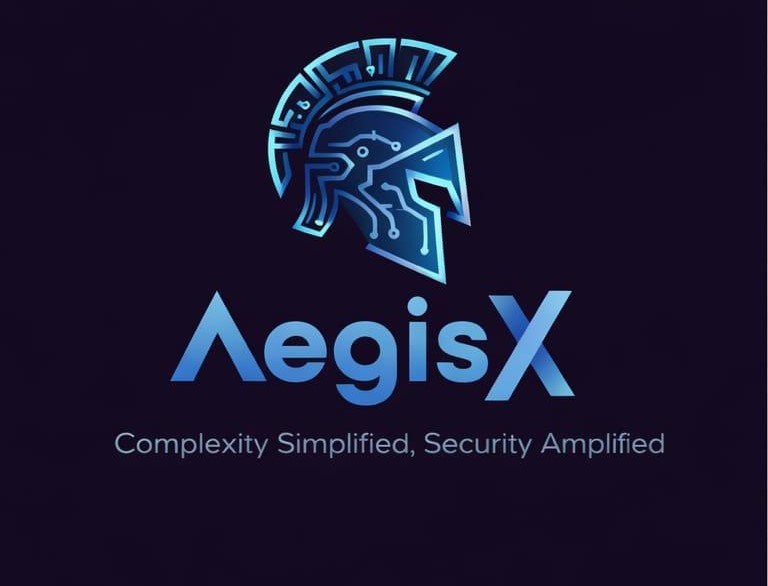
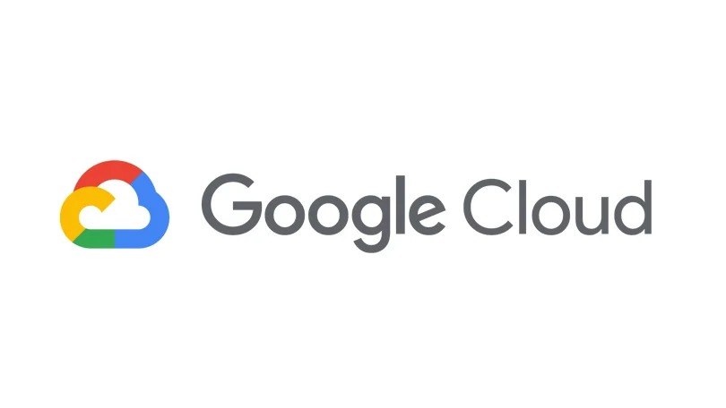
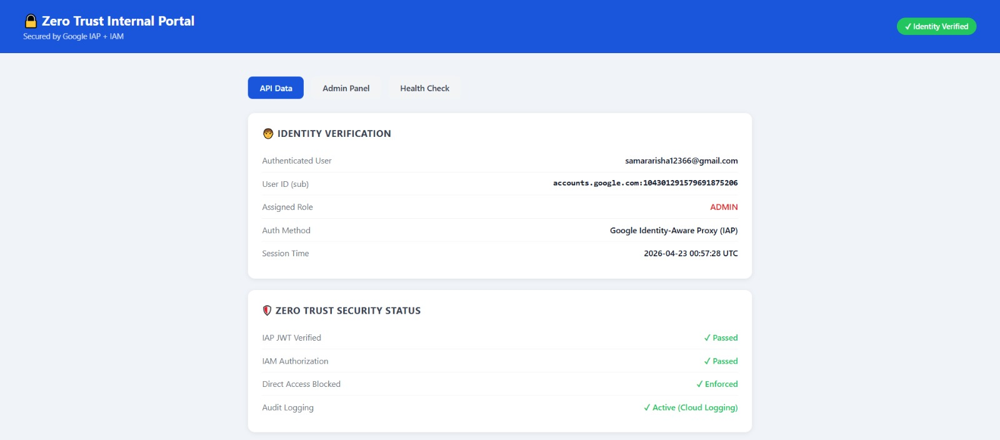

&nbsp;&nbsp;&nbsp;&nbsp;&nbsp;

  

# 🔒 Zero Trust Security Model
### Built on Google Cloud Platform

---

## 📌 Overview

An internal secure portal protected by **Google Identity-Aware Proxy (IAP)** and **IAM**.  
Every request is verified before it reaches the application — no VPN, no IP whitelisting.

---

## 🏗️ Architecture
Internet
│
▼
[ HTTPS Load Balancer ]        ← Only entry point
│
▼
[ Identity-Aware Proxy ]       ← Google login enforced here
│
├── ✗ Unauthorized → Blocked immediately
│
▼
[ Cloud Run — Flask App ]      ← JWT verified + Role checked
│
├── Admin  → Full access
└── Viewer → Limited access
---

## 🔑 Access Control

| Role | Dashboard | API Data | Admin Panel |
|------|:---------:|:--------:|:-----------:|
| 🔴 Admin | ✅ | ✅ | ✅ |
| 🔵 Viewer | ✅ | ✅ | ❌ |
| ⛔ Unauthorized | blocked | blocked | blocked |

---

## 🛡️ Security Layers

| Layer | Technology | What It Does |
|-------|-----------|--------------|
| Gateway | Cloud Load Balancer | Single HTTPS entry point |
| Authentication | Google IAP | Forces Google login |
| Authorization | Google IAM | Controls who is allowed in |
| Token Verification | JWT (ES256) | Cryptographically validates every request |
| Access Control | RBAC | Limits what each role can do |
| Audit | Cloud Logging | Logs every action |

---

## 📸 Screenshots

### ✅ Authorized Access — Zero Trust Dashboard

 

### ⛔ Unauthorized Access — Blocked by IAP

---

## ⚙️ Tech Stack

`Python` `Flask` `Docker` `Google Cloud Run` `IAP` `IAM` `JWT` `Cloud Load Balancer`

---

## 📄 Documentation

Full technical documentation → [`AegisX_ZeroTrust_Documentation2.pdf`](AegisX_ZeroTrust_Documentation2.pdf)

---

AegisX Security Team &nbsp;·&nbsp; Google Cloud Platform &nbsp;·&nbsp; 2026

